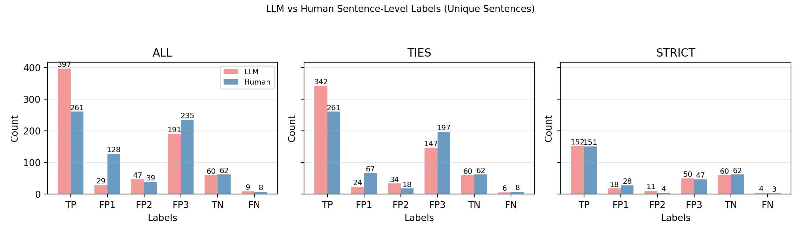
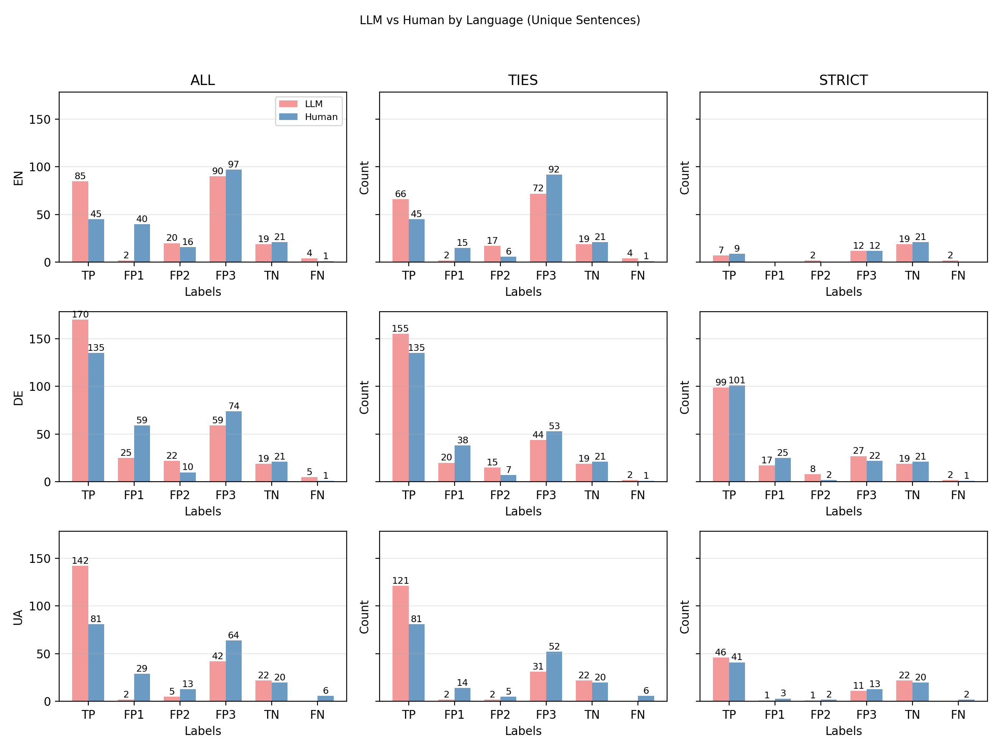
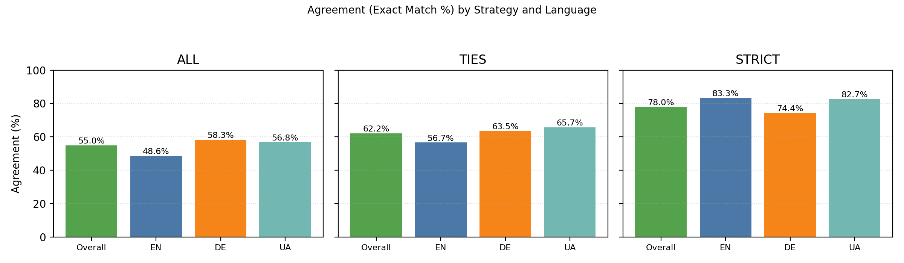

# GEC Annotation Analysis — Three Filtering Strategies

**Goal:** Compare LLM vs Human sentence-level labels under three dataset filtering regimes and recommend the best setting.

## 1. Filtering strategies (brief)

* **ALL:** keep all samples with valid sentence-level labels (no edit-level filtering).
* **TIES:** drop samples with edit-level ties (dominant label not unique).
* **STRICT:** keep only samples with ≥3 annotators agreeing on the dominant edit label.

## 2a. Retention after filtering

* **ALL:**
  * Overall: kept 733/733 (100.0%), dropped 0 (0.0%)
  * EN: kept 220/220 (100.0%)
  * DE: kept 300/300 (100.0%)
  * UA: kept 213/213 (100.0%)
* **TIES:**
  * Overall: kept 613/733 (83.6%), dropped 120 (16.4%)
  * EN: kept 180/220 (81.8%)
  * DE: kept 255/300 (85.0%)
  * UA: kept 178/213 (83.6%)
* **STRICT:**
  * Overall: kept 295/733 (40.2%), dropped 438 (59.8%)
  * EN: kept 42/220 (19.1%)
  * DE: kept 172/300 (57.3%)
  * UA: kept 81/213 (38.0%)

## 2b. Overall LLM vs Human (all languages)

## 2c. By language — LLM vs Human across techniques

## 2d. English examples (4 per label, ALL)

* **TP:**
  * {Took=>For some reason, I kept the:::llm_FP2:::human_TP(TP:2,FP2:1)} ticket in my pocket{ for some reason,=> and:::llm_TP:::human_TP(TP:3)} went to a party near Cambridge. [LLM: FP2, Human: TP]
  * {Swedish Motivation=>:::llm_TP:::human_TP} I actually {maintain=>practice:::llm_TP:::human_TP(TP:3)} my {french=>French:::llm_TP:::human_TP(TP:3)} with music when I don't have anyone {I talk french with=>to converse with in French,:::llm_TP:::human_TP(TP:3)} so I highly recommend this! [LLM: TP, Human: TP]
  * {Yeah that’s fair,=>That’s a fair point;:::llm_FP3:::human_TP(TP:3)} the national parks {are a hassle=>can be difficult:::llm_TP:::human_TP(TP:2,FP3:1)} to {get=>access:::llm_TP:::human_TP(TP:3)} from Zanzibar. [LLM: FP3, Human: TP]
  * {Went=>I went:::llm_TP:::human_TP(TP:3)} to {bed,=>bed and:::llm_TP:::human_TP(TP:3)} eventually got home at {7pm=>7 PM:::llm_TP:::human_TP(TP:2,FP3:1)} the next day. [LLM: TP, Human: TP]
* **FP1:**
  * {This=>This is not a subsidy; this:::llm_FP1:::human_FP1(FP1:1)} is why you need to read up on the subject. [LLM: FP1, Human: FP1]
  * Megathread: Job Offer Status Incoming Ignorance: {Currently I’m=>Currently, I am a:::llm_TP:::human_FP2(TP:1,FP2:1,FP3:1)} GS{=> employee:::llm_FP2:::human_FP1(TP:1,FP1:1,FP3:1)} with the USAF. [LLM: FP2, Human: FP1]
  * Reeves seeks to shield lenders in{=> a:::llm_TP:::human_TP(TP:2,FP2:1)} car loan mis-selling case after the Treasury warned{=> that:::llm_TP:::human_FP2(TP:1,FP2:1,FP3:1)} it could damage Britain’s reputation as a place to do {business Except that's not how it worked at all.=>business.:::llm_TP:::human_FP1(TP:1,FP1:2)} [LLM: TP, Human: FP1]
  * African immigrant{ makes nazi=> is seen making a Nazi:::llm_TP:::human_FP1(FP1:1)} salute {behing=>behind:::llm_TP:::human_TP(TP:1)} the seal of the United States. [LLM: TP, Human: FP1]
* **FP2:**
  * It took five months to {decide they'd possibly=>ascertain that they might have:::llm_TP:::human_FP2(FP2:1)} committed a crime and{=> to:::llm_TP:::human_FP3(FP3:1)} charge them. [LLM: TP, Human: FP2]
  * {Yep,=>Indeed,:::llm_FP3:::human_FP2(TP:1,FP2:1)} all professions are like {that.=>that:::llm_TP:::human_FP2} "Hon är {doktor",=>doktor,":::llm_TP:::human_TP(TP:1)} "hon är {pilot"=>pilot,":::llm_TP:::human_FP2(FP2:1)} and so on. [LLM: FP3, Human: FP2]
  * Made a $369 billion investment in climate change, the largest in American history, through the {Inflation=>Inflation:::llm_TP:::human_FP2(FP2:1,FP3:1)} Reduction Act of 2022. [LLM: TP, Human: FP2]
  * Humza Yousaf{ accuses=> has accused:::llm_TP:::human_TP(TP:2,FP3:1)} David Lammy of {racism Which is prejudice against the=>racism, which constitutes a prejudice against:::llm_TP:::human_FP2(TP:1,FP2:1,FP3:1)} rural {person=>individuals:::llm_TP:::human_TP(TP:2,FP2:1)} by {happenstance.=>chance.:::llm_TP:::human_FP3(FP1:1,FP3:2)} [LLM: TP, Human: FP2]
* **FP3:**
  * They{ have to=> must:::llm_FP3:::human_FP3(FP3:3)} deal with extraordinary circumstances; when we, the people, are scared and afraid, they must not hesitate. [LLM: FP3, Human: FP3]
  * There are direct flights {out of=>available from:::llm_FP3:::human_FP3(FP3:3)} JFK, {EWR=>EWR,:::llm_FP3:::human_FP3(TP:1,FP3:2)} and PHL. [LLM: FP3, Human: FP3]
  * I would say that after about 2 {months=>months,:::llm_TP:::human_FP3(FP3:1)} my comprehension started{ increasing dramatically.=> to increase significantly.:::llm_TP:::human_FP3(FP3:1)} [LLM: TP, Human: FP3]
  * Chinese{=> speakers who:::llm_TP:::human_TP(TP:2,FP1:1)} already {speaking English French=>know English, French,:::llm_TP:::human_TP(TP:3)} and {Dutch, want=>Dutch wish:::llm_TP:::human_FP3(TP:1,FP3:2)} to learn {nordic=>Nordic:::llm_TP:::human_TP(TP:3)} languages. [LLM: TP, Human: FP3]
* **TN:**
  * It’s a lovely city with the Ribeira district, Livraria Lello, and amazing views. (missing_errors:1/3) [LLM: TN, Human: TN] [LLM_reasoning: No corrections were needed as the sentence is grammatically correct and properly punctuated. The ori...]
  * I want to say hello in the coolest way possible. (missing_errors:0/3) [LLM: TN, Human: TN] [LLM_reasoning: No corrections needed, sentence is already grammatically correct. The original sentence is well-form...]
  * You're putting in way more thought than any of them. (missing_errors:0/3) [LLM: TN, Human: TN] [LLM_reasoning: No corrections needed, sentence is already correct. The original sentence is grammatically sound and...]
  * What can I yell at a hockey game to show support for the Latvian team? (missing_errors:1/3) [LLM: TN, Human: TN] [LLM_reasoning: No grammatical or orthographic corrections were needed; the original sentence is grammatically corre...]
* **FN:**
  * Question About Budget Cuts and Job Promises Nordic countries have strong private sectors that are rich as a nation to support their economies not their own governments. (missing_errors:2/3) [LLM: FN, Human: FN] [LLM_reasoning: The phrase 'rich as a nation' was awkward and could be misinterpreted; 'sufficiently wealthy' clarif...]

## 2e. Agreement analysis (per technique)

* **ALL:** overall 55.0%; EN 48.6%; DE 58.3%; UA 56.8%
* **TIES:** overall 62.2%; EN 56.7%; DE 63.5%; UA 65.7%
* **STRICT:** overall 78.0%; EN 83.3%; DE 74.4%; UA 82.7%

## 2f. Inter-annotator agreement (Fleiss' kappa)

* **Method:** Fleiss' kappa over edit-level mapped categories {TP, FP3, FP2, FP1}.
  * **ALL:** overall kappa=0.245; EN=0.185; DE=0.251; UA=0.259
  * **TIES:** overall kappa=0.318; EN=0.283; DE=0.298; UA=0.353
  * **STRICT:** overall kappa=0.441; EN=1.000; DE=0.356; UA=0.468

## 2g. LLM-Human Agreement (Cohen's kappa)

* **Method:** Cohen's kappa between LLM and human sentence-level labels.
* **ALL:** overall kappa=0.363; EN=0.291; DE=0.381; UA=0.360
* **TIES:** overall kappa=0.435; EN=0.370; DE=0.414; UA=0.451
* **STRICT:** overall kappa=0.666; EN=0.746; DE=0.583; UA=0.723

## 2h. Conclusion (which setting is best?)

* **Agreement:** ALL=55.0%, TIES=62.2%, STRICT=78.0%
* **Retention:** ALL=100.0%, TIES=83.6%, STRICT=40.2%
* **Inter-Annotator Agreement (Fleiss' κ):**
  * **ALL:** κ=0.245 (fair agreement)
  * **TIES:** κ=0.318 (fair agreement)
  * **STRICT:** κ=0.441 (moderate agreement)
* **Recommendation:** ALL (best agreement–retention trade-off for current data). Use STRICT when precision and label quality are paramount; use ALL for scale; use TIES as a balanced middle ground.
